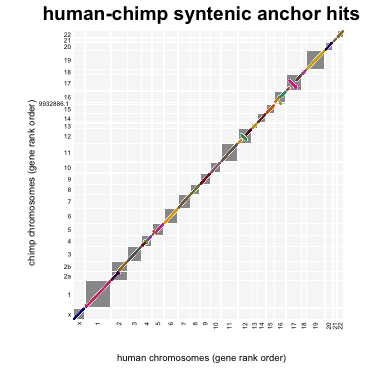
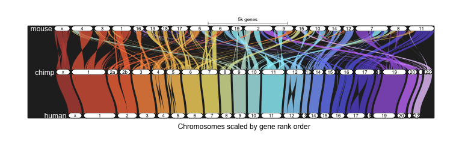
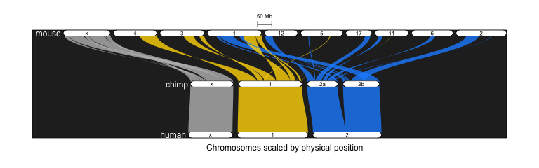

# 1. Overview

GENESPACE is a comparative genomics framework implemented in the R environment for statistical computing. The premise is that, when analyzing high-quality genome assemblies and annotations, we can improve the confidence of evolutionary inference by combining two sources of evidence for common ancestry: synteny (i.e. collinearity of gene order) and coding sequence similarity (homology). In addition to providing a second line of evidence beyond sequence similarity, combining synteny and homology have several benefits:

- exclude paralogous regions
- control for variable ploidy among genomes
- search for orthologs within single-copy regions
- infer expected gene position across genomes: a priori hypothesis about presence-absence variation
- track genes in regions of interest (e.g. QTL intervals)

GENESPACE outputs a synteny-constrained and -anchored orthogroup pan-genome annotation among multiple genomes. This simple text file allows for extraction and exploration of regional gene-level variation, a necessary step to integrate comparative and quantitative genomic goals. 

# 2. Quick start

**Install and load GENESPACE**. Assuming `orthofinder`, `MCScanX`, `GENESPACE` and dependencies are installed (see 3. installation below), enter R and run:.


```r
library(GENESPACE)
```

```
## Loading required package: data.table
```

and genomes being used are all from NCBI, here is the full pipeline to build syntenic pan-genome annotations and make plots. Here, we are going to use human, chimpanzee and mouse genomes from NCBI. Each genome is a haploid representation of the diploid genotypes, so ploidy = 1. 

**Get the GENESPACE run initialized**. All the major parameters and paths to raw files are set here. 

**NOTE** You'll see some warning messages about being unable to run orthofinder. This just means you'll need to call orthofinder from the terminal outside of R. 


```r
gpar <- init_genespace(
  # -- unique genome IDs. these can't start with a number of special character
  genomeIDs = c("human","chimp","mouse"), 
  
  # -- subdirectory in the rawGenomeDir matching genomeIDs
  speciesIDs = c("Homo_sapiens","Pan_troglodytes","Mus_musculus"),
  
  # -- subdirectory in rawGenomeDir/speciesIDs containing the genome to use. 
  # -- for example, the human genome is here:
  # -- ~/Desktop/mammalGenespace/rawRepo/Homo_sapiens/GRCh38.p13/annotation
  versionIDs = c("GRCh38.p13", "Clint_PTRv2", "GRCm39"),
  
  # -- the genome assemblies are haploid, even though the species are diploid
  ploidy = c(1, 1, 1),
  
  # -- using a default orthofinder run as the primary database. 
  # -- alternatively could use the "fast" method, which is a bit less accurate
  orthofinderMethod = "default",
  
  # -- where should the run be stored? make sure you have read/write privs. 
  wd = "~/Desktop/mammalGenespace/run1",
  
  # -- how many parallel processes should be run?
  nCores = 4, 
  
  # -- what are the unique strings that specify gff and peptide fasta files?
  gffString = "gff", 
  pepString = "translated_cds",
  
  # -- how do you call orthofinder, diamond and MCScanX?
  path2orthofinder = "orthofinder",
  path2diamond = "diamond",
  path2mcscanx = "~/Documents/comparative_genomics/programs/MCScanX",
  
  # -- where are the raw genomes stored? See above. 
  rawGenomeDir = "~/Desktop/mammalGenespace/rawRepo")
```

```
## set working directory to /Users/jlovell/Desktop/mammalGenespace/run1
```

```
## Warning in value[[3L]](cond): cannot call diamond from diamond
```

```
## Warning in check_orthofinderInstall(path2orthofinder, verbose = T): Cannot call orthofinder from path specified to GENESPACE
## 	Run orthofinder outside of R with commands supplied
```

```
## Warning in value[[3L]](cond): cannot call diamond from diamond
```

```
## 
## found raw gff files:
## 	 /Users/jlovell/Desktop/mammalGenespace/rawRepo/Homo_sapiens/GRCh38.p13/annotation/GCF_000001405.39_GRCh38.p13_genomic.gff.gz
## 	/Users/jlovell/Desktop/mammalGenespace/rawRepo/Pan_troglodytes/Clint_PTRv2/annotation/GCF_002880755.1_Clint_PTRv2_genomic.gff.gz
## 	/Users/jlovell/Desktop/mammalGenespace/rawRepo/Mus_musculus/GRCm39/annotation/GCF_000001635.27_GRCm39_genomic.gff.gz
## 
## found raw peptide files:
## 	 /Users/jlovell/Desktop/mammalGenespace/rawRepo/Homo_sapiens/GRCh38.p13/annotation/GCF_000001405.39_GRCh38.p13_translated_cds.faa.gz
## 	/Users/jlovell/Desktop/mammalGenespace/rawRepo/Pan_troglodytes/Clint_PTRv2/annotation/GCF_002880755.1_Clint_PTRv2_translated_cds.faa.gz
## 	/Users/jlovell/Desktop/mammalGenespace/rawRepo/Mus_musculus/GRCm39/annotation/GCF_000001635.27_GRCm39_translated_cds.faa.gz 
## 
## GENESPACE run initialized:
## 	Initial orthofinder database generation method: default
## 	Collinear array detection method: global
## 	Orthology graph method: global
```


**Parse the genomes into GENESPACE format**, which is a simplified gff3-like text file with a column `id` that exactly matches the peptide fasta header. If your genome is not NCBI or phytozome formatted, this can be tricky. See the help file for `?parse_annotations` for more info.


```r
parse_ncbi(gsParam = gpar, overwrite = T)
```

```
## Parsing annotations: human
## 	Reading gff ... found 19532 protein coding genes
## 	Reading peptide fasta ... found 124038 / 19532 total and unique entries
## 	Merging fa and gff found 19532 matching entires
## Parsing annotations: chimp
## 	Reading gff ... found 21504 protein coding genes
## 	Reading peptide fasta ... found 80985 / 21504 total and unique entries
## 	Merging fa and gff found 21504 matching entires
## Parsing annotations: mouse
## 	Reading gff ... found 22186 protein coding genes
## 	Reading peptide fasta ... found 93165 / 22186 total and unique entries
## 	Merging fa and gff found 22186 matching entires
```

**Set the synteny parameters**. There are a lot of parameters, see `?set_syntenyParams`, but the defaults should be fine for most situations. See vignette 1 for more details. To see the full parameterization, print the synteny parameters as `print(gpar$params$synteny)`. This can be edited manually if needed to fine-tune the synteny search to diverse patterns of genome evolution.


```r
gpar <- set_syntenyParams(gsParam = gpar)
```

**Run orthofinder**. If orthofinder is installed and in the path, this command will run orthofinder from R, but this is not necessary, or even preferable. Instead, it will print the command and you can run that in an environment with orthofinder in the path. 

Given the specification and missing orthofinder install, the initial `run_orthofinder` call without an existing orthofinder run will look like this: 


```r
gpar <- run_orthofinder(gsParam = gpar, overwrite = F)

# 	Cleaning out orthofinder directory and prepping run
# 	Could not find valid orthofinder executable in the path
# 	Run the following command outside of R (assuming orthofinder is in the path):
# ################
# orthofinder -f /Users/jlovell/Desktop/mammalGenespace/run1/peptide -t 4 -a 1 -X -o ~/Desktop/mammalGenespace/run1/orthofinder
# ################
```

Now open a terminal window, and either add orthofinder to your path, or install from conda: 


```bash
# conda create -n orthofinder
conda activate orthofinder # or add orthofinder to the path
# conda install -c bioconda orthofinder 
```

Then ensure that your working directory is set to the GENESPACE working directory and run orthofinder by pasting the command from above. This will take 5-30 minutes to run, depending on your system. 


```bash
cd ~/Desktop/mammalGenespace/run1/orthofinder
orthofinder -f /Users/jlovell/Desktop/mammalGenespace/run1/peptide -t 4 -a 1 -X -o 
```

**Add arrays and other metadata to the gffs**. Subsetting the search to representatives of collinear arrays is a crucial step to accurate synteny inference. The behavior of this step depends on whether `recallArrays = TRUE`. Here, since `orthofinder` is not in the path of R, arrays are not re-called. 


```r
gpar <- annotate_gff(gsParam = gpar, overwrite = T)
```

```
## Loading annotations ...
## 	Indexing location of orthofinder results ... Done!
## 	Reading the gffs ... Done!
## 	Pulling gene lengths ... Done!
## 	Parsing global orthogroups ... Done!
## Defining collinear orthogroup arrays ... 
## 	Using collinear orthogroups for array identity:
## 	chimp: 2338 genes in 814 collinear arrays
## 	human: 2149 genes in 719 collinear arrays
## 	mouse: 4585 genes in 883 collinear arrays
## 	Choosing array representative genes ... Done!
## Writing gff to file: ~/Desktop/mammalGenespace/run1/results/gffWithOgs.txt.gz
```

**Constrain blast results to synteny**. The primary engine of GENESPACE is `synteny`, which parses an orthofinder run into syntenic orthogroups. This operates on the syntenyParameters generated from `set_syntenyParam`. The synteny-constrained hits and corresponding dotplots are stored by default in the /results directory.


```r
blks <- synteny(gsParam = gpar, overwrite = T)
```

```
## Setting up input data
## 	Parsing annotations ... 
## 	Found 63222 genes, 19626 orthogroups and 2416 arrays with 9072 genes
## Pulling within-genome synteny
## 	Genome: n raw hits / hits in (regions) / hits in (blks)
## 	human   (selfhit): 61980 / 61980 (29) / 61980 (29)
```

```
## 	chimp   (selfhit): 65970 / 65970 (39) / 65970 (39)
```

```
## 	mouse   (selfhit): 115153 / 115153 (26) / 115153 (26)
```

```
## Pulling intergenomic synteny
## 	human  -chimp   (primary): 260292 / 49264 (44) / 47315 (93)
```

```
## 	human  -mouse   (primary): 275661 / 45991 (209) / 44790 (284)
```

```
## 	chimp  -mouse   (primary): 281906 / 47466 (227) / 45630 (301)
```

```
## Done
```

**Look at they synteny-constrained blastp hits**. 


```r
annBlast <- fread(
  file.path(gpar$paths$results, "human_chimp_synHits.txt.gz"),
  na.strings = c("", "NA"), showProgress = F)
gsGff <- fread(
  file.path(gpar$paths$results, "gffWithOgs.txt.gz"),
  na.strings = c("", "NA"), showProgress = F)
dpData <- plot_hits(
  hits = annBlast, 
  gff = gsGff, 
  plotRegions = T, 
  anchorOnly = T,
  plotTitle = "human-chimp syntenic anchor hits")
```

<!-- -->

**Find synteny-constrained orthogroups**. Using the synteny databases generated during `synteny`, split global orthogroups into subgraphs with edges only connected by syntenic edges. The behavior of this function depends on whether `orthofinderInBlk = TRUE` or not. Here, since we are dealing with only haploid genomes, it only runs the global method. 


```r
gpar <- pull_synOGs(gsParam = gpar)
```

```
## Checking synteny-constrained global orthogroups for synOGs
## 	n. global OGs = 19626
## 	n. syntenic OGs = 22561
```

**Make a multi-species synteny plot**. The riparian plot tracks synteny across multiple genomes, color coding and ordering chromosomes by synteny to a reference genomes. There are a lot of parameters to optimize the appearence. See the help file.


```r
ripd  <- plot_riparian(gsParam = gpar)
```

```
## 	Loading the gff ... Done!
## 	Mapping genes against human chromosomes ... Done!
## 	Projecting linear coordinate system ... Done!
## 	Generating block coordinates ... Done!
## 	Rendering plot ...
```

<!-- -->

```
## Done!
```
**Zoom in on a couple chromosomes**. Showing some common parameters that might be useful. Here, only showing just three human chromosomes, with new colors, using physical position instead of gene rank order. 

```r
ripd  <- plot_riparian(
  gsParam = gpar, 
  refGenome = "human",
  onlyTheseChrs = c("X",1:2),
  colByChrs = c("grey","gold","dodgerblue"), 
  useOrder = F)
```

```
## 	Loading the gff ... Done!
## 	Mapping genes against human chromosomes ... Done!
## 	Projecting linear coordinate system ... Done!
## 	Generating block coordinates ... Done!
## 	Rendering plot ...
```

<!-- -->

```
## Done!
```

**Build the pangenome**. Here, the synteny constrained hits are used to predict their positions against a chosen reference genome. Then the orthology networks are decoded into a tabular format. 


```r
pg <- pangenome(
  gsParam = gpar, 
  refGenome = "human")
```

```
## Combining synteny-constrained and inblock orthogroups ...
## 	syn OGs: 22561, inblk OGs: 0, combined OGs: 22561
## 	Flagged 6388 non-syntenic orthologs
## 	Pulling block coordinates against human ...
## 		Found 49452 anchors for 678 blocks
## Determining reference position for combined orthogroups ...
## 	Linear interpolation of gene order in reference ... Done!
## 	Orthogroup clustering and median position determination ... Done!
## 	Pos. count: 0x = 1140, 1x = 21415, 2x = 9, 3x = 0 4x = 0, 4+x = 0
## Building the pan-genome annotation ...
## 	Initial build with ... 
## 		56566 genes, 22561 OGs and 22570 placements and 1137 unplaced OGs
## 	Adding in array members ... 
## 		Found 6656 genes, 1699 OGs and 1703/194 placed/unplaced OGs
## 	Adding in non-syntenic orthologs ... 
## 		Found 3991 genes, 2918 OGs and new 2923 entries
## 	Formating and writing the pangenome ... 
## Pangenome written to results/human_pangenomeDB.txt.gz
```

**Query the pangenome**. Pull presence absence and geneID information from the pangenome. 


```r
query_pangenome(
  pg = pg, 
  refChrom = "1", 
  startOrder = 10, 
  endOrder = 15)
```

```
## $raw
##    pgID og chr ord                           chimp    human         mouse
## 1:    8  8   1  10                           PERM1    PERM1         Perm1
## 2:    9  9   1  11                            HES4     HES4              
## 3:   10 10   1  12                           ISG15    ISG15         Isg15
## 4:   11 11   1  13                            AGRN     AGRN          Agrn
## 5:   12 12   1  14 LOC746419,LOC112208569,PRAMEF20                       
## 6:   13 13   1  14                          RNF223   RNF223        Rnf223
## 7:   14 14   1  15                      C1H1orf159 C1orf159 9430015G10Rik
## 
## $pav
##    pgID og chr ord chimp human mouse
## 1:    8  8   1  10  TRUE  TRUE  TRUE
## 2:    9  9   1  11  TRUE  TRUE FALSE
## 3:   10 10   1  12  TRUE  TRUE  TRUE
## 4:   11 11   1  13  TRUE  TRUE  TRUE
## 5:   12 12   1  14  TRUE FALSE FALSE
## 6:   13 13   1  14  TRUE  TRUE  TRUE
## 7:   14 14   1  15  TRUE  TRUE  TRUE
## 
## $cnts
##    pgID og chr ord chimp human mouse
## 1:    8  8   1  10     1     1     1
## 2:    9  9   1  11     1     1     0
## 3:   10 10   1  12     1     1     1
## 4:   11 11   1  13     1     1     1
## 5:   12 12   1  14     3     0     0
## 6:   13 13   1  14     1     1     1
## 7:   14 14   1  15     1     1     1
```


# 3. Setup

### 3.1 Installing Dependencies

The GENESPACE R package is designed only for use MacOSX and Linux. Testing on OSX 10.16 (Big Sur) and __ (). The R package requires that `MCScanX` is [installed](https://github.com/wyp1125/MCScanX) as well as the following R dependencies:

- R/data.table (v1.13.6 or later)
- R/igraph (v1.2.6 or later)
- R/Biostrings (v2.58.0 or later)
- R/dbscan (v1.1-5 or later)

GENESPACE cannot be run without results from `orthofinder`. This can be installed on a separate server or locally. The simplest method is with conda: `conda install -c bioconda orthofinder`, but other methods are available. See [orthofinder documentation](https://github.com/davidemms/OrthoFinder). 


### 3.2 Install GENESPACE

To install GENESPACE, enter R, either by typing `R` into the command line or `open -na rstudio` for RStudio. If not installed, install the `devtools` package via `install.packages("devtools")`. This will permit one-line installation from the gitlab repo. 

Install genespace: `devtools::install_github("https://github.com/jtlovell/GENESPACE")`

This should also install the dependencies, `data.table`, `igraph`, and `dbscan`. For full functionality, also install the following: `Biostrings` and `Rutils`. 

If devtools is not available or you'd prefer, you can install from the provided [zip file](https://github.com/jtlovell/GENESPACE/archive/refs/heads/dev.zip), saved in a location where you have execute privileges. If running on the command line, prior to entering R, run: `R cmd install path/to/GENESPACE.tar.gz`. Alternatively, if running GENESPACE from RStudio, open Rstudio once the orthofinder conda environment is activated, then install GENESPACE by clicking on the 'install' icon under the 'packages' tab. Select 'install from package archive file' and navigate to the location of the saved GENESPACE.tar.gz file. 

### 3.3 Input data format

GENESPACE requires two inputs for each genome: primary transcript annotation peptide fasta files and gene feature coordinates. The sequence headers in the fasta must be able to parsed to match the attributes column of the gff3 gene annotation. 

If data comes from phytozome, you want the 'gene.gff3' and 'protein_primaryTranscriptOnly.fa' files. 

If data comes from NCBI, you to get the data from the 'FTP directory for RefSeq assembly' file tree and download the 'genomic.gff.gz' and 'translated_cds.faa.gz' files. 

If getting data from other sources, you may need to ensure that your gene IDs can be properly matched. It is not necessary to have only the primary transcript, as GENESPACE will take the longest uniquely named sequence. However, in many cases the longest transcript is not the primary, so care should be taken. 


# 5. Legal

GENESPACE R Package (GENESPACE) Copyright (c) 2021,HudsonAlpha Institute for Biotechnology. All rights reserved.

If you have questions about your rights to use or distribute this software, please contact Berkeley Lab's Intellectual Property Office at IPO@lbl.gov.

NOTICE. This Software was developed under funding from the U.S. Department of Energy and the U.S. Government consequently retains certain rights. As such, the U.S. Government has been granted for itself and others acting on its behalf a paid-up, nonexclusive, irrevocable, worldwide license in the Software to reproduce, distribute copies to the public, prepare derivative  works, and perform publicly and display publicly, and to permit others to do so.


*** License Agreement ***

GENESPACE R Package (GENESPACE) Copyright (c) 2021, HudsonAlpha Institute for Biotechnology. All rights reserved.

Redistribution and use in source and binary forms, with or without modification, are permitted provided that the following conditions are met:
(1) Redistributions of source code must retain the above copyright notice, this list of conditions and the following disclaimer.

(2) Redistributions in binary form must reproduce the above copyright notice, this list of conditions and the following disclaimer in the documentation and/or other materials provided with the distribution.

(3) Neither the name of the HudsonAlpha Institute for Biotechnology nor the names of its contributors may be used to endorse or promote products derived from this software without specific prior written permission.


THIS SOFTWARE IS PROVIDED BY THE COPYRIGHT HOLDERS AND CONTRIBUTORS "AS IS" AND ANY EXPRESS OR IMPLIED WARRANTIES, INCLUDING, BUT NOT LIMITED TO, THE IMPLIED WARRANTIES OF MERCHANTABILITY AND FITNESS FOR A PARTICULAR PURPOSE ARE DISCLAIMED. IN NO EVENT SHALL THE COPYRIGHT OWNER OR CONTRIBUTORS BE LIABLE FOR ANY DIRECT, INDIRECT, INCIDENTAL, SPECIAL, EXEMPLARY, OR CONSEQUENTIAL DAMAGES (INCLUDING, BUT NOT LIMITED TO, PROCUREMENT OF SUBSTITUTE GOODS OR SERVICES; LOSS OF USE, DATA, OR PROFITS; OR BUSINESS INTERRUPTION) HOWEVER CAUSED AND ON ANY THEORY OF LIABILITY, WHETHER IN
CONTRACT, STRICT LIABILITY, OR TORT (INCLUDING NEGLIGENCE OR OTHERWISE) ARISING IN ANY WAY OUT OF THE USE OF THIS SOFTWARE, EVEN IF ADVISED OF THE POSSIBILITY OF SUCH DAMAGE.

You are under no obligation whatsoever to provide any bug fixes, patches, or upgrades to the features, functionality or performance of the source code ("Enhancements") to anyone; however, if you choose to make your Enhancements available either publicly, or directly to Lawrence Berkeley National Laboratory, without imposing a separate written license agreement for such Enhancements, then you hereby grant the following license: a non-exclusive, royalty-free perpetual license to install, use, modify, prepare derivative works, incorporate into other computer software, distribute, and sublicense such enhancements or derivative works thereof, in binary and source code form.
